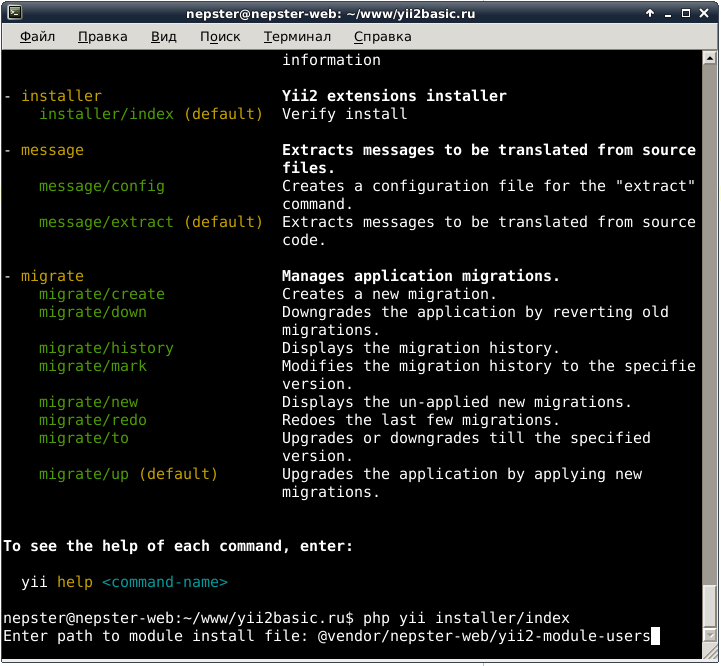
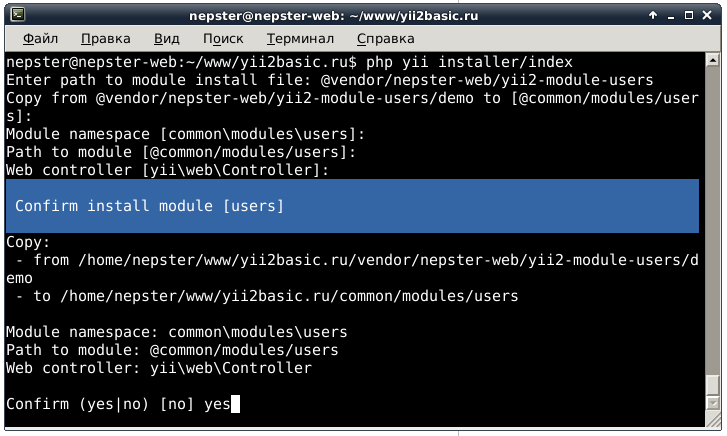
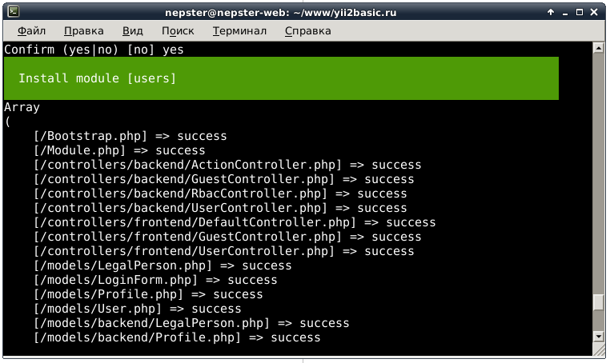

# Быстрый старт

 * После успешной [установки и настройки](install.md) модуля пользователей Вы можете приступать к изменению и написанию функционала.
 * Доступные [демонстрационные данные](demo.md) могут быть изменены по Вашему желанию. 
 * Общая [структура](structure.md) модуля.

## Установка в шаблон [advanced](https://github.com/yiisoft/yii2-app-advanced)

 1) **[Установите и настройте приложение](https://github.com/yiisoft/yii2-app-advanced/blob/master/docs/guide/start-installation.md) с шаблоном advanced.**
 
 2) **[Отредактируйте файл composer.json](https://github.com/nepster-web/yii2-module-users/blob/master/docs/install.md#%D0%A3%D1%81%D1%82%D0%B0%D0%BD%D0%BE%D0%B2%D0%BA%D0%B0), как описывается в инструкции модуля.**
 
 3) **Запустите необходимую команду и начните установку модуля:**
 

    
 4) **Укажите нужные пути для установки модуля в приложение:** 

    
 5) **Перепроверьте данные и подтвердите установку:**
 

    
    
    
    
## Установка в шаблон [basic](https://github.com/yiisoft/yii2-app-basic)

 1) **[Установите и настройте приложение](https://github.com/yiisoft/yii2-app-basic#installation) с шаблоном basic.**
 
 2) **[Отредактируйте файл composer.json](https://github.com/nepster-web/yii2-module-users/blob/master/docs/install.md#%D0%A3%D1%81%D1%82%D0%B0%D0%BD%D0%BE%D0%B2%D0%BA%D0%B0), как описывается в инструкции модуля.**
 
 3) **Запустите необходимую команду и начните установку модуля:**
 
